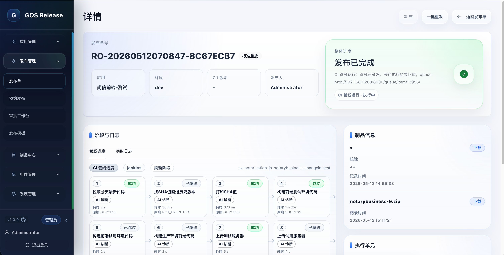
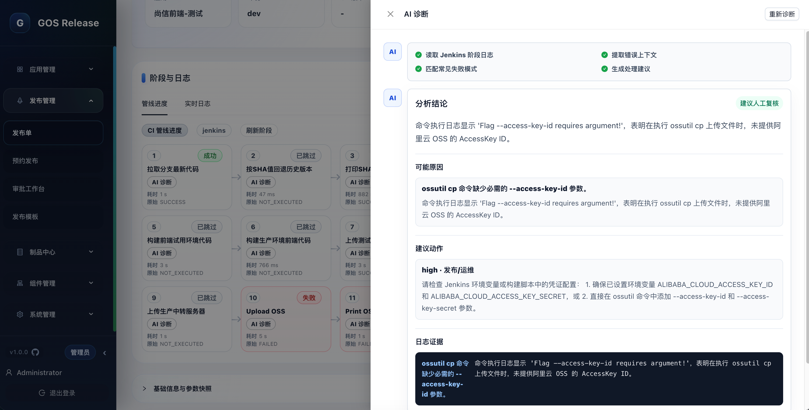
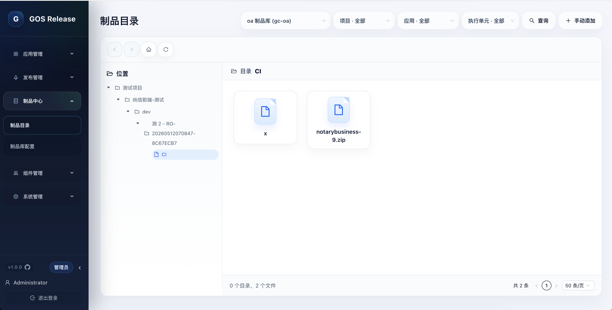
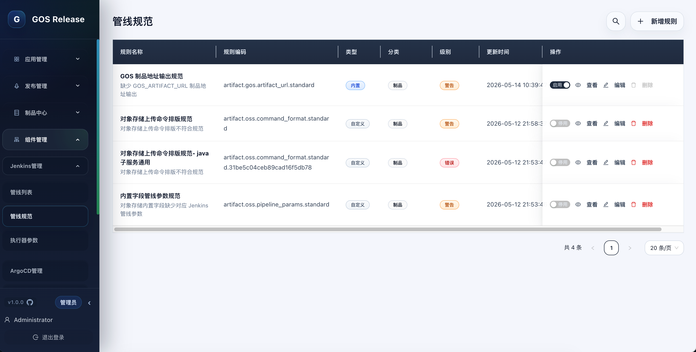
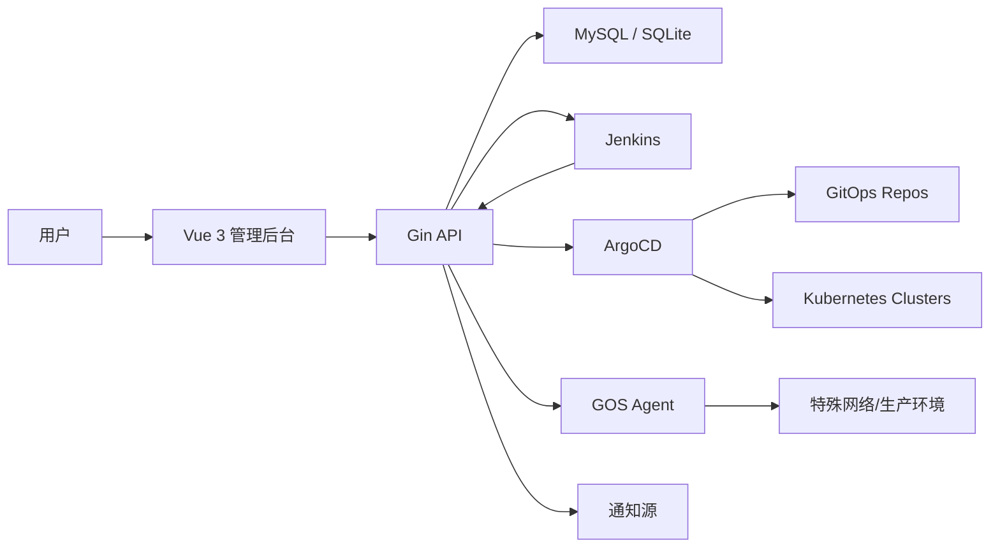

<div align="center">

<h1 align="center">GOS Release · 发布治理平台</h1>

<p><strong>一张发布单，串起交付全链路。</strong></p>

<p>
  
  
  
  
  
  
</p>

<p>
  
  
  
  
  
  
  
  
  
</p>

<p>GOS 不是 Jenkins、ArgoCD 或 Agent 的替代品，而是它们上层的发布治理层。</p>

<p>GOS 只做一件事：把分散执行收口成可治理的发布流程。</p>

</div>

---

## 🎯 为什么选择 GOS？

内部发布平台真正复杂的地方，不是单个执行器，而是发布链路被拆散在太多系统里。

应用负责人、项目归属、发布环境、Jenkins 参数、管线脚本规范、GitOps 仓库、ArgoCD 实例、Agent 脚本、制品产物、通知 Hook、审批人和执行权限分散维护。研发需要理解大量底层细节，平台也很难回答一次发布到底用了什么参数、跑了哪条管线、产出了哪些制品、失败在哪里、通知是否送达。

GOS 将这些链路收口成发布单：

- 统一入口：从发布单发起标准发布、极速发布、仅构建、分段部署、回滚和重放，减少 Jenkins / ArgoCD / Git 仓库 / Agent 任务之间的切换。
- 模板治理：用发布模板固化 CI/CD 执行单元、参数映射、审批规则、Hook 和通知策略，避免每次发布临时拼流程。
- 管线约束：通过管线规范对 Jenkins Pipeline 做底层、有边界的约束，保证制品地址输出、OSS 上传命令、内置参数映射等关键节点可被平台识别。
- 参数收敛：用标准字库和高级参数展示规则隐藏底层映射细节，只让申请人填写真正需要输入的字段。
- 执行追踪：在发布单详情里查看预检、审批、构建、部署、Hook、阶段日志、制品信息和 AI 诊断结论。
- 制品沉淀：用制品中心聚合发布过程产物、校验信息、记录时间和下载入口，避免制品链接散落在流水线日志里。
- 诊断闭环：对 Jenkins 阶段日志做 AI 诊断，提取错误上下文、可能原因、日志证据和处理建议。
- 通知闭环：把飞书、企业微信（企微）、钉钉通知源、Markdown 模板和通知 Hook 配成平台能力。
- 权限与审计：统一控制应用、环境、组件、模板、制品库、通知和系统管理入口，并沉淀发布参数、执行单元、阶段、Agent 任务、制品元信息、AI 诊断记录和通知结果。

---

## 🧭 标准化

GOS 的标准化不是要求所有团队使用同一条流水线，而是把发布过程中必须统一的边界先定下来。

- 标准入口：所有发布、回滚、重放都从发布单进入。
- 标准对象：项目、应用、环境、执行器、模板、制品库、发布单和通知源统一建模。
- 标准字段：应用、环境、分支、镜像、Helm values、制品地址等关键参数统一命名和来源。
- 标准参数：基础字段、固定值、CI 沿用、CD 沿用、GitOps 替换和 Hook 变量按同一套规则流转。
- 标准模板：把 CI/CD、审批、Hook、通知、参数规则和管线规范前置到模板里。
- 标准管线：对制品地址输出、OSS 上传命令、内置参数等关键边界做规则校验，不侵入团队自定义流水线逻辑。
- 标准制品：发布过程产出的包、校验信息、对象路径和下载入口统一沉淀到制品中心。
- 标准诊断：失败阶段可以回到同一个发布上下文中查看日志、AI 诊断、可能原因和建议动作。
- 标准流程：预检、审批、管线规范校验、执行、制品归档、Hook、通知、AI 诊断、回滚和审计按同一套生命周期流转。
- 标准留痕：每一次参数、操作、执行单元、阶段日志、制品元信息、AI 诊断和通知结果都能回到发布单追踪。

执行器可以不同，网络环境可以不同，部署方式也可以不同；但申请人看到的是同一套发布语言，平台沉淀的是同一套治理数据。

---

## ⚙️ 当前已落地能力

### 🧾 发布单工作台

围绕发布单组织完整发布生命周期。

- 发布单创建、编辑、删除、执行、取消。
- 支持标准发布、极速发布、仅构建、分段部署、回滚和重放。
- 批量执行、批量删除、并发批次进度和执行状态追踪。
- 发布前预检覆盖发布单状态、执行单元、参数完整性、并发锁冲突和模板合规性。
- 应用维度回滚能力检测、当前上线状态确认与历史状态追踪。
- 发布详情聚合执行单元、实时日志、阶段日志、Hook 进度、制品信息和 AI 诊断结果。

### ✅ 审批与发布模板

把发布规则前置到模板，而不是让每次发布临时决定。

- 发布模板 CRUD，按应用绑定可用发布流程。
- CI / CD 执行器绑定，支持 Jenkins、ArgoCD / GitOps 和 Agent 任务组合。
- CI / CD 参数映射、固定值、基础字段、CI 参数沿用和高级参数展示。
- 隐藏基础字段映射和 CD 沿用 CI 的参数，降低发布申请页面复杂度。
- 模板审批开关、审批模式、审批人配置、审批工作台和审批记录。
- 模板 Hook 配置，支持 Agent 任务、通知 Hook 和发布后补充动作。
- 发布创建前校验模板执行单元、参数、管线规范和权限边界。

### 🧱 Jenkins 管理

让 Jenkins 专注执行，GOS 负责治理入口。

- Jenkins 管线同步、列表、详情和原始链接跳转。
- 执行器参数同步，并映射到平台标准字段。
- 原始脚本 / Config XML 查看，支持原始 Jenkins Pipeline 创建、编辑、删除。
- 单条管线校验和批量管线扫描，帮助提前发现执行器不可用或脚本不合规。
- Jenkins 构建日志、阶段状态、阶段日志回写发布单。
- 与管线规范、制品中心、AI 诊断联动，补齐从构建到排障的发布链路。

### 📏 管线规范

在不接管团队 Pipeline 业务逻辑的前提下，对发布链路必须可治理的底层边界做规则约束。

- 规则管理支持内置规则和自定义规则，可按制品、安全、凭据、命名等分类维护。
- 支持 `info`、`warning`、`error` 等级，规则可启停并记录更新时间。
- 扫描 Jenkins Pipeline 脚本，输出违规行、匹配内容、处理建议和扫描状态。
- 内置 `GOS_ARTIFACT_URL` 制品地址输出规范，确保 CI 产物能被发布单、CD、GitOps 和 Hook 继续沿用。
- 支持 OSS 上传命令格式、内置字段参数映射等制品链路规范。
- 发布模板可按 CI / CD 绑定管线规范校验范围，违反阻断级规则时阻止创建发布单。
- 约束重点放在平台必须识别的边界上，保留团队对 Pipeline 内部业务步骤的自主权。

### 🧠 AI 诊断

把 Jenkins 阶段日志转成结构化排障结果，降低失败定位成本。

- 系统设置维护 OpenAI Compatible 模型，支持测试连接、启停和设置诊断模型。
- 发布单详情的 Jenkins 阶段节点展示 AI 诊断入口，失败阶段可快速进入排障。
- 后端拉取阶段日志，完成脱敏、截断、错误上下文提取后调用诊断模型。
- 诊断抽屉展示分析结论、可能原因、日志证据、建议动作和人工复核提示。
- 支持重新诊断、诊断缓存、历史结果查看和快捷追问。
- 诊断记录保存模型、日志 hash、创建人和时间，便于审计追踪。

### 🚢 ArgoCD / GitOps 管理

面向声明式部署场景，串起环境、仓库、应用和集群。

- 多 ArgoCD 实例管理、连通性检查和环境绑定。
- ArgoCD Application 列表、详情、原始链接和手动 Sync。
- GitOps 实例管理、仓库状态检查和路径映射。
- GitOps 模板字段、字段候选值、values 候选值和替换规则。
- Helm / Kustomize 扫描路径配置。
- 发布时解析链路：`env -> ArgoCD -> GitOps -> Git 仓库`。
- 可沿用 CI 产出的制品地址、镜像版本和标准参数，保持构建到部署参数一致。

### 🛰️ Agent 与受控任务

用于生产孤岛、网络隔离或平台无法直连目标环境的场景。

- Agent 注册、心跳、在线 / 离线 / 忙碌状态。
- Agent 启用、禁用、维护模式、安装配置生成与 Token 重置。
- 临时任务、常驻任务、指定 Agent 分发。
- Shell 任务、脚本文件任务、文件分发任务。
- 脚本管理：脚本模板、Shell 类型、脚本文本、脚本路径。
- 任务执行、停止、恢复、删除、日志和结果回传。
- 发布模板可把 Agent 任务配置为 Hook，发布详情中展示 Hook / Agent 任务进度和日志。

### 📦 制品中心

把发布过程产出的文件纳入统一目录，避免制品链接散落在流水线日志里。

- 制品库配置、连接测试和凭据加密存储。
- 应用绑定制品库与制品路径，发布时自动注入 OSS 内置参数。
- 管线规范约束制品上传和 `GOS_ARTIFACT_URL` 输出，保证平台能识别 CI 产物。
- CI 标准字段 `gos_artifact_url` 可沿用至 CD、GitOps 和 Hook 变量。
- 发布单详情展示制品名称、校验信息、记录时间和下载入口。
- 制品目录按制品库、项目、应用、执行单元和发布单聚合检索。
- 支持手动补录制品，并限制删除发布过程自动产出的制品记录。

### 🔔 通知模块

把通知源、模板和 Hook 配成平台能力，而不是散落在流水线脚本里。

- 通知源管理：飞书、企业微信（企微）、钉钉。
- Markdown 通知模板和条件化模板内容。
- 通知 Hook 管理，发布模板可按阶段和触发条件关联通知 Hook。
- 通知内容可复用发布单、应用、环境、执行结果、制品和 Hook 上下文。
- 通知源 Secret / Token / 飞书放行关键字加密存储。

### 🔐 应用、项目与权限治理

把发布入口和组织权限绑定起来。

- 项目管理和应用归属治理。
- 应用 CRUD、负责人、仓库、语言、制品类型、制品库和制品路径。
- 应用 GitOps 分支映射、发布分支选项和环境策略。
- 应用与 CI/CD 管线绑定，支持应用级执行器选择。
- 标准字库管理，统一发布字段、执行器参数、GitOps 替换和通知变量来源。
- 应用级可见 / 发布权限控制、用户管理、权限授权和参数权限。
- 系统设置：发布环境、并发控制、GitOps 扫描路径和 AI 模型配置。

---

## 🖼️ 界面预览

<p align="center"><strong>应用工作台</strong></p>

<p align="center">
  
</p>

<p align="center"><strong>发布单详情页</strong></p>

<p align="center">
  
</p>

<p align="center"><strong>发布单详情：制品信息与 AI 诊断入口</strong></p>

<p align="center">
  
</p>

<p align="center"><strong>AI 诊断抽屉</strong></p>

<p align="center">
  
</p>

<p align="center"><strong>制品目录</strong></p>

<p align="center">
  
</p>

<p align="center"><strong>管线规范</strong></p>

<p align="center">
  
</p>

<p align="center"><strong>发布单列表页</strong></p>

<p align="center">
  
</p>

<p align="center"><strong>新建发布单页</strong></p>

<p align="center">
  
</p>

<p align="center"><strong>发布模板配置</strong></p>

<p align="center">
  
</p>

---

## 🏗️ 架构概览



后端采用轻量分层：

- `internal/domain`：领域实体与仓储接口
- `internal/application`：用例编排
- `internal/infrastructure`：数据库、Jenkins、ArgoCD、GitOps、配置、加密
- `internal/interfaces/http`：Gin 路由与 Handler

---

## 🧩 技术栈

| 层级 | 技术 |
| --- | --- |
| 后端 | Go 1.25、Gin、Swagger |
| 存储 | MySQL、SQLite |
| 前端 | Vue 3、Vite、TypeScript、Pinia、Ant Design Vue、ECharts |
| 执行器 | Jenkins、ArgoCD / GitOps、GOS Agent |
| 部署 | Docker 单容器、源码运行 |

---

## 🚀 快速开始

### 方式一：Docker 单容器运行

适合部署到目标机器，单容器同时提供前端和后端服务。

本地构建镜像：

```bash
docker build -t gos-release:latest .
```

MySQL 模式启动：

```bash
docker run -d \
  --name gos-release \
  -p 5174:5174 \
  -p 8081:8081 \
  -e GOS_DB_DRIVER=mysql \
  -e GOS_MYSQL_DSN='user:password@tcp(mysql-host:3306)/deploy_platform?charset=utf8mb4&parseTime=true&loc=Local' \
  -e GOS_JENKINS_ENABLED=true \
  -e GOS_JENKINS_BASE_URL='http://jenkins.example.com/' \
  -e GOS_JENKINS_USERNAME='admin' \
  -e GOS_JENKINS_API_TOKEN='your-token' \
  -e GOS_AUTH_ADMIN_USERNAME='admin' \
  -e GOS_AUTH_ADMIN_PASSWORD='your-admin-password' \
  -e GOS_SECURITY_ENCRYPTION_KEY='replace-with-a-strong-key' \
  yl10115658529/gos-release:v1.2.2
```

> **说明**：GOS_SECURITY_ENCRYPTION_KEY 用于加密数据，请自定义 。

访问地址：

- 登入：`http://127.0.0.1:5174/login`

首次部署 MySQL 时，可先导入仓库内表结构：

```bash
mysql -h mysql-host -P 3306 -u user -p < ./deploy_platform.sql
```

### 方式二：源码开发

环境要求：

- Go `1.25+`
- Node.js `20+`
- MySQL `8+` 或 SQLite
- Jenkins / ArgoCD / GitOps / Agent / 制品库 / AI 模型 / 通知源按需准备

启动后端：

```bash
go run ./cmd/server -config configs/config.local.json
```

启动前端：

```bash
cd frontend
npm install
VITE_API_BASE_URL=http://127.0.0.1:8081 npm run dev
```

---

## 🛠️ 配置说明

源码运行时主要读取配置文件，例如：

- `configs/config.local.json`
- `configs/config.production.json`

Docker 单容器运行时由 `docker/entrypoint.sh` 根据环境变量生成：

- `/app/configs/config.runtime.json`

常用 Docker 环境变量：

| 变量 | 说明 |
| --- | --- |
| `GOS_DB_DRIVER` | 数据库类型：`mysql` 或 `sqlite` |
| `GOS_MYSQL_DSN` | MySQL 连接串 |
| `GOS_SQLITE_PATH` | SQLite 文件路径 |
| `GOS_JENKINS_ENABLED` | 是否启用 Jenkins |
| `GOS_JENKINS_BASE_URL` | Jenkins 地址 |
| `GOS_JENKINS_USERNAME` | Jenkins 用户名 |
| `GOS_JENKINS_API_TOKEN` | Jenkins API Token |
| `GOS_JENKINS_AUTO_SYNC_ENABLED` | 是否启用 Jenkins 自动同步 |
| `GOS_JENKINS_AUTO_SYNC_INTERVAL_SEC` | Jenkins 自动同步间隔 |
| `GOS_JENKINS_RELEASE_TRACK_ENABLED` | 是否启用发布构建追踪 |
| `GOS_AUTH_ADMIN_USERNAME` | 初始管理员账号 |
| `GOS_AUTH_ADMIN_PASSWORD` | 初始管理员密码 |
| `GOS_SECURITY_ENCRYPTION_KEY` | 平台加密密钥 |
| `GOS_RELEASE_ENV_OPTIONS` | 发布环境列表，例如 `dev,test,prod` |
| `GOS_RELEASE_CONCURRENCY_ENABLED` | 是否启用发布并发锁 |
| `GOS_RELEASE_LOCK_SCOPE` | 锁范围，例如 `application_env` |
| `GOS_RELEASE_CONFLICT_STRATEGY` | 冲突策略，例如 `reject` |
| `GOS_GITOPS_PATH_MAPS` | GitOps 路径映射，格式 `宿主机路径=容器内路径` |

生产环境务必使用强密码、独立加密密钥，并避免在日志或命令历史中暴露 Token。

---

## 🗺️ 页面地图

| 模块 | 页面 | 路由 |
| --- | --- | --- |
| 入口 | 官网 / 产品页 | `/` |
| 入口 | 登录 | `/login` |
| 应用管理 | 我的应用 | `/applications` |
| 应用管理 | 新增应用 | `/applications/new` |
| 应用管理 | 编辑应用 | `/applications/:id/edit` |
| 应用管理 | 管线绑定 | `/applications/:id/pipeline-bindings` |
| 应用管理 | 项目管理 | `/projects` |
| 应用管理 | 标准字库 | `/platform-param-dicts` |
| 发布管理 | 发布单 | `/releases` |
| 发布管理 | 新建发布单 | `/releases/new` |
| 发布管理 | 编辑发布单 | `/releases/:id/edit` |
| 发布管理 | 发布单详情 | `/releases/:id` |
| 发布管理 | 审批工作台 | `/release-approvals` |
| 发布管理 | 发布模板 | `/release-templates` |
| 制品中心 | 制品目录 | `/artifacts` |
| 制品中心 | 制品库配置 | `/artifacts/repositories` |
| 组件管理 | Jenkins 管线 | `/components/jenkins` |
| 组件管理 | 管线规范 | `/components/pipeline-rules` |
| 组件管理 | 执行器参数 | `/components/executor-params` |
| 组件管理 | ArgoCD 管理 | `/components/argocd` |
| 组件管理 | ArgoCD 应用 | `/components/argocd/applications` |
| 组件管理 | GitOps 管理 | `/components/gitops` |
| 组件管理 | GitOps 教程 | `/help/gitops` |
| 组件管理 | Agent 概览 | `/components/agents` |
| 组件管理 | Agent 脚本管理 | `/components/agent-scripts` |
| 组件管理 | Agent 任务管理 | `/components/agent-tasks` |
| 系统管理 | 用户管理 | `/system/users` |
| 系统管理 | 权限授权 | `/system/permissions` |
| 系统管理 | 通知模块 | `/system/notifications` |
| 系统管理 | 系统设置 / AI 模型 | `/system/settings` |

---

## 🧪 初始化顺序

第一次落地建议按这个顺序做：

1. 启动后端和前端
2. 登录管理员账号
3. 配置发布环境和并发策略
4. 创建用户并授权
5. 创建项目和应用
6. 按需接入 Jenkins / ArgoCD / GitOps / Agent / 制品库 / AI 模型 / 通知源
7. 绑定应用与 CI/CD 执行器
8. 维护标准字库、执行器参数和管线规范
9. 创建发布模板，配置审批与 Hook
10. 创建发布单，执行并查看详情

完整说明见：`docs/使用手册/GOS从0到1初始化使用指南.md`

---

## 📁 项目结构

```text
gos/
├── agent                       # Agent 相关代码
├── cmd/server                  # 后端入口
├── configs                     # 配置文件
├── docker                      # 单容器运行配置
├── docs                        # Swagger、需求文档、样式规范、测试清单
├── frontend                    # Vue 3 管理后台
├── images                      # README 截图素材
├── internal/application        # 用例层
├── internal/bootstrap          # 启动与配置
├── internal/domain             # 领域层
├── internal/infrastructure     # 基础设施层
├── internal/interfaces/http    # Gin 接口层
└── scripts                     # 辅助脚本
```

---

## 📚 文档索引

- Docker 部署：`docs/部署/Docker部署说明.md`
- 初始化使用指南：`docs/使用手册/GOS从0到1初始化使用指南.md`
- Swagger：`docs/swagger.yaml`
- 后端需求：`docs/后端/`
- 前端需求：`docs/前端/`
- AI 诊断功能设计：`docs/ai-diagnosis-feature.md`
- 前端样式规范：`docs/样式规范/`
- 测试清单与报告：`docs/测试/`

---

## 🛣️ Roadmap

以下内容在需求文档中有规划，但不要理解为当前已完整落地能力：

- K8s 发布策略引擎
- 多平台小程序发布
- 更细粒度的发布策略可视化
- 外部身份源接入：LDAP / SSO

---

## 💬 联系

<p>
  
</p>

---

## 📄 License

本项目基于 MIT License 开源，详见 [LICENSE](./LICENSE)。
