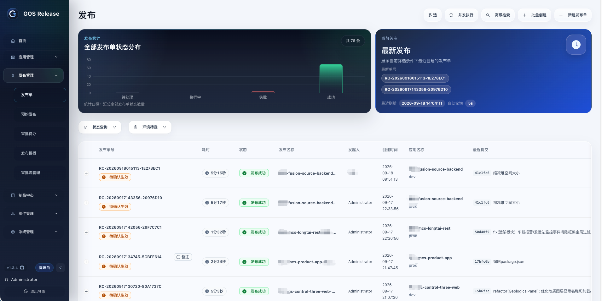
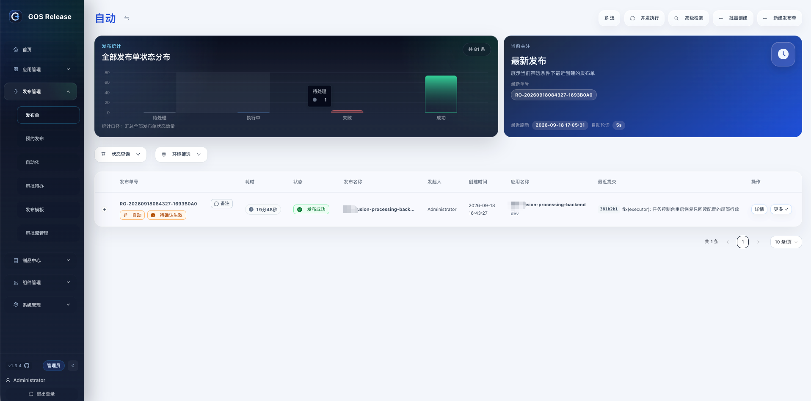
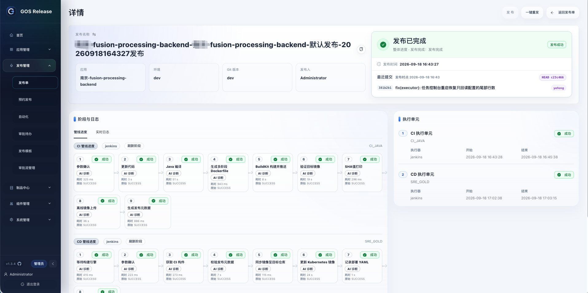
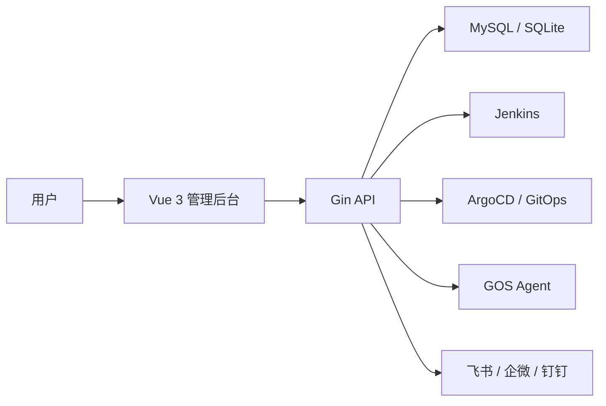

# GOS Release · 发布治理平台

**一张发布单，串起交付全链路。**

GOS 不替代 Jenkins、ArgoCD 或 Agent，而是它们上层的发布治理层：把散落在各系统里的发布执行，收口成可审批、可追踪、可审计的发布单。


### 🌐 在线体验

**[http://36.151.150.63:5174](http://36.151.150.63:5174/)**　账号 `admin`　密码 `admin123`

体验环境数据会定期清理，请勿录入生产凭据或敏感信息。




### 界面预览

发布单列表：按触发方式一键切换，自动触发（配置了发布自动化）的单据带「自动」标记，最近提交直接显示在行内。



发布单详情：CI / CD 阶段与执行单元逐段留痕，顶部卡片给出整体进度与发布时点的分支 HEAD、提交信息与提交人。



## 核心能力

- **发布单收口**：标准发布、极速发布、仅构建、分段部署、回滚、重放都从发布单发起，不用在 Jenkins、ArgoCD、Git 仓库、Agent 之间来回切换。
- **模板治理**：发布模板固化执行单元、参数映射、审批规则、Hook 和通知策略，发布前统一预检。
- **管线规范**：对 Jenkins Pipeline 只约束平台必须识别的边界（制品地址输出、OSS 上传命令、内置参数），不接管团队业务步骤。
- **审批流**：可视化画布编排整单 / CI 前 / CD 前审批，支持环境匹配、或签会签、主管审批与审批留痕。
- **实时追踪**：SSE 推送执行单元、阶段日志、Hook 与审批进度，失败阶段可一键 AI 诊断。
- **发布自动化**：给应用配好发布模板、参数与分支，后台盯着分支提交，有新提交自动建单并按「仅构建 / 构建并发布 / 仅发布」派发；手工单在途时自动让路，构建完成的单子自动续跑部署。
- **制品沉淀**：CI 产物统一归档到制品中心，`gos_artifact_url` 可沿用至 CD、GitOps 和 Hook。
- **权限与审计**：应用、环境、模板、制品库、通知分层授权，参数、执行、制品和通知结果全程留痕。

## Docker 部署

单容器同时提供前端页面和后端 API；MySQL、Jenkins、ArgoCD、GitOps 建议继续使用外部已有服务。

### 1. 拉取镜像

```bash
docker pull yl10115658529/gos-release:v1.3.4
```

本地构建改为 `docker build -t gos-release:latest .`。

### 2. 启动（MySQL）

```bash
docker run -d --name gos-release \
  -p 5174:5174 -p 8081:8081 \
  -e GOS_DB_DRIVER=mysql \
  -e GOS_MYSQL_DSN='gos:password@tcp(192.168.1.10:3306)/gos_release?charset=utf8mb4&parseTime=true&loc=Local' \
  -e GOS_AUTH_ADMIN_USERNAME=admin \
  -e GOS_AUTH_ADMIN_PASSWORD='your-admin-password' \
  -e GOS_SECURITY_ENCRYPTION_KEY='replace-with-a-strong-key' \
  -e GOS_JENKINS_ENABLED=true \
  -e GOS_JENKINS_BASE_URL='http://jenkins.example.com/' \
  -e GOS_JENKINS_USERNAME=admin \
  -e GOS_JENKINS_API_TOKEN='your-token' \
  yl10115658529/gos-release:v1.3.4
```

访问 `http://127.0.0.1:5174/login`；健康检查 `curl -i http://127.0.0.1:5174/healthz`，正常返回 `200`。

`GOS_MYSQL_DSN`、`GOS_AUTH_ADMIN_PASSWORD`、`GOS_SECURITY_ENCRYPTION_KEY` 三项必填。前端默认走 5174 同源反代后端，`8081` 只在需要直接调试接口时暴露。

### 3. 启动（SQLite，本地试跑）

```bash
docker run -d --name gos-release \
  -p 5174:5174 \
  -v gos_release_data:/app/data \
  -e GOS_DB_DRIVER=sqlite \
  -e GOS_SQLITE_PATH=/app/data/demo.db \
  -e GOS_AUTH_ADMIN_PASSWORD='admin123' \
  -e GOS_SECURITY_ENCRYPTION_KEY='gos-release-local-key' \
  yl10115658529/gos-release:v1.3.4
```

### 4. Docker Compose（含 MySQL）

```bash
cp .env.example .env   # 填写 GOS_MYSQL_PASSWORD、GOS_MYSQL_ROOT_PASSWORD、GOS_AUTH_ADMIN_PASSWORD、GOS_SECURITY_ENCRYPTION_KEY
docker compose up -d --build
```

前端 `5174`，后端 `8081`。生产使用 `docker-compose.prod.yml`，MySQL 不对外暴露端口。

### 5. 常用环境变量


| 变量                                                               | 说明                                  |
| ---------------------------------------------------------------- | ----------------------------------- |
| `GOS_DB_DRIVER`                                                  | `mysql` 或 `sqlite`，默认 `mysql`       |
| `GOS_MYSQL_DSN`                                                  | MySQL 连接串，`mysql` 模式必填              |
| `GOS_SQLITE_PATH`                                                | SQLite 文件路径，默认 `/app/data/demo.db`  |
| `GOS_AUTH_ADMIN_USERNAME` / `_PASSWORD`                          | 首次初始化管理员账号与密码                       |
| `GOS_SECURITY_ENCRYPTION_KEY`                                    | 平台加密密钥，用于凭据加密，必填                    |
| `GOS_JENKINS_ENABLED` / `_BASE_URL` / `_USERNAME` / `_API_TOKEN` | Jenkins 接入配置                        |
| `GOS_JENKINS_AUTO_SYNC_ENABLED` / `_INTERVAL_SEC`                | 管线自动同步，默认开启、300 秒，启动即同步一次           |
| `GOS_RELEASE_ENV_OPTIONS`                                        | 发布环境列表，默认 `dev,test,prod`           |
| `GOS_RELEASE_CONCURRENCY_ENABLED` / `_LOCK_SCOPE`                | 发布并发锁，默认开启，锁范围 `application_env`    |
| `GOS_GITOPS_PATH_MAPS`                                           | GitOps 路径映射 `宿主路径=容器内路径`，多条用 `;` 分隔 |


容器启动时由 `docker/entrypoint.sh` 生成 `/app/configs/config.runtime.json`。

## 源码开发

环境要求：Go `1.25+`、Node.js `20+`、MySQL `8+` 或 SQLite。

```bash
go run ./cmd/server -config configs/config.local.json

cd frontend
npm install
VITE_API_BASE_URL=http://127.0.0.1:8081 npm run dev
```

## 技术栈


| 层级  | 技术                                                 |
| --- | -------------------------------------------------- |
| 后端  | Go 1.25、Gin、Swagger                                |
| 存储  | MySQL、SQLite                                       |
| 前端  | Vue 3、Vite、TypeScript、Pinia、Ant Design Vue、ECharts |
| 执行器 | Jenkins、ArgoCD / GitOps、GOS Agent                  |
| 部署  | Docker 单容器、源码运行                                    |





后端为轻量分层：`internal/domain`（领域）、`internal/application`（用例）、`internal/infrastructure`（数据库与执行器适配）、`internal/interfaces/http`（Gin 路由）。

## 文档索引

- [用户操作手册](docs/USER_GUIDE.md)：从零跑通一条 Jenkins 发布链路
- [Docker 部署说明](docss/部署/Docker部署说明.md)
- [P0 到 P1 初始化指南](docss/使用手册/GOS从0到1初始化使用指南.md)
- [应用接入向导](docs/first-release-onboarding.md)
- [Swagger / OpenAPI](docs/swagger.yaml)
- 需求与设计文档：`docss/后端/`、`docss/前端/`、`docss/样式规范/`

## License

本项目基于 MIT License 开源，详见 [LICENSE](./LICENSE)。