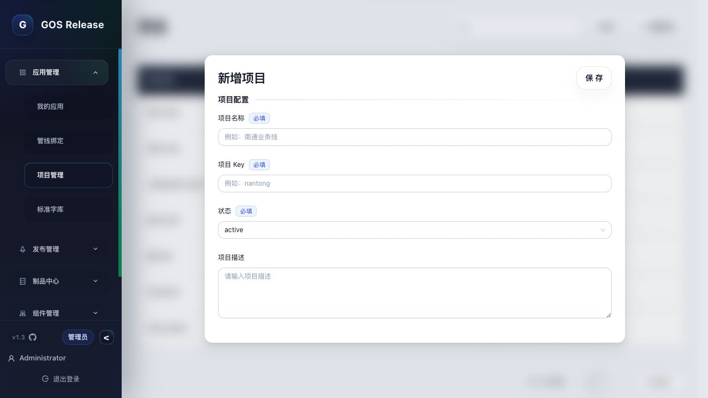
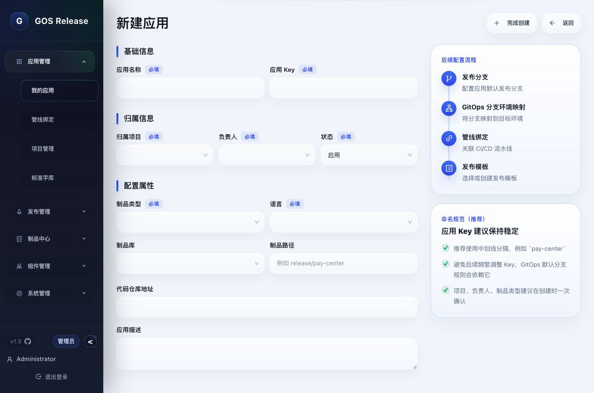
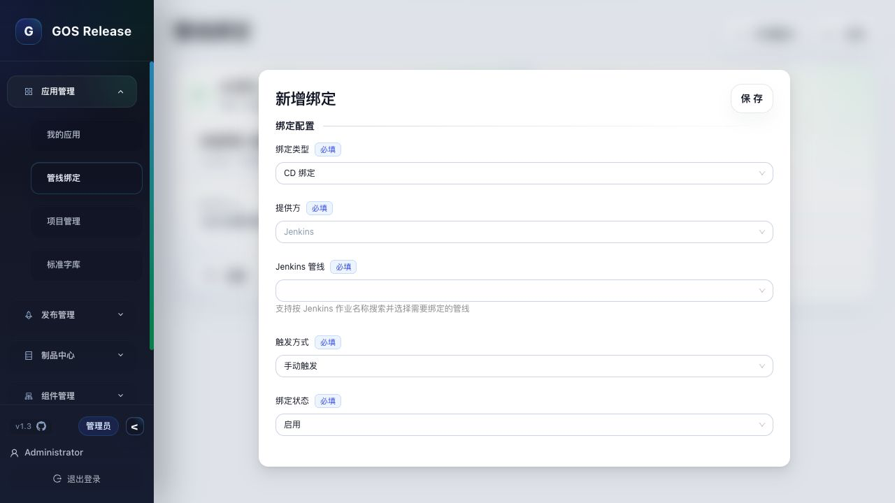
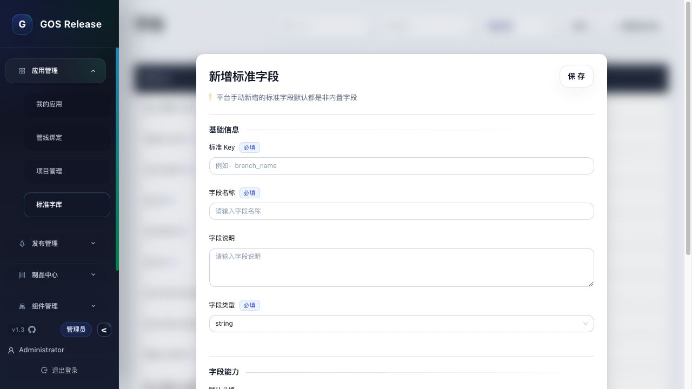
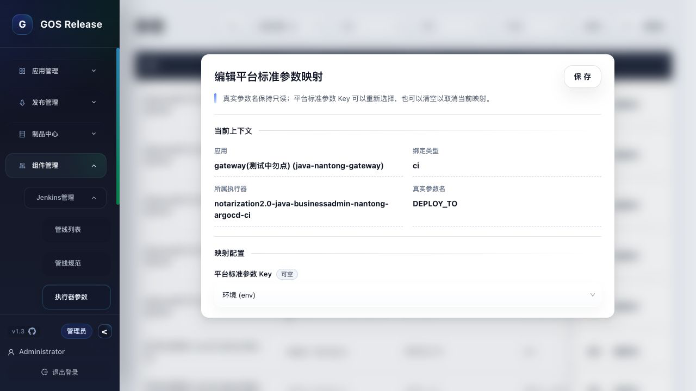
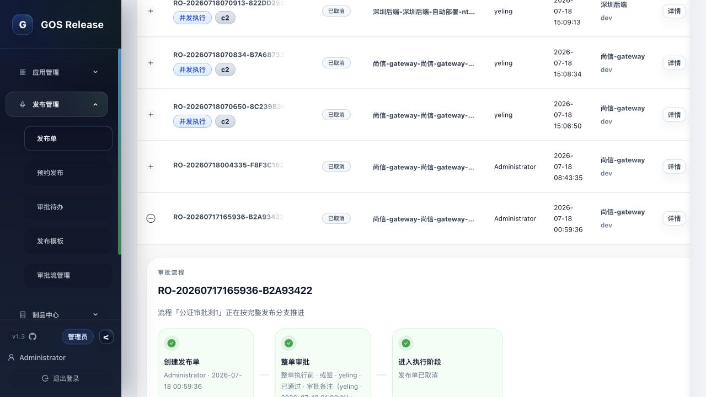
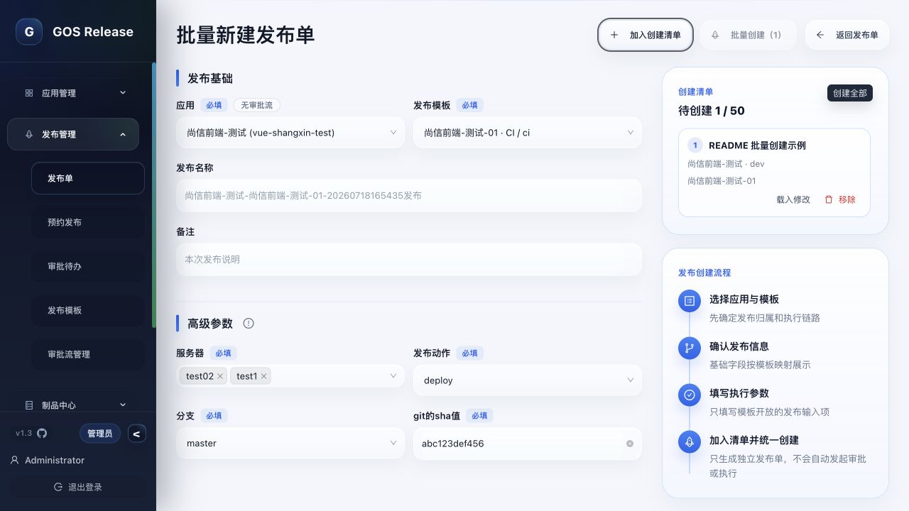

# GOS Release 用户操作手册

本手册面向第一次使用 GOS Release 的研发、测试、运维和发布负责人，介绍如何从零完成一条可用的 Jenkins 发布链路。

> 最短使用路径：创建项目 → 创建应用 → 绑定管线 → 建立标准字库 → 完成参数映射 → 创建发布模板 → 创建发布单 → 发起发布。

## 1. 先理解整个配置关系

这些对象各自解决的问题如下：

| 对象 | 作用 | 示例 |
| --- | --- | --- |
| 项目 | 对应用进行业务归类 | 电商平台 |
| 应用 | 表示一个可独立构建、部署的服务 | order-service |
| 管线绑定 | 指定应用实际使用的 Jenkins CI/CD Job | order-service-build |
| 标准字库 | 用 GOS 统一名称描述不同管线中的同类参数 | `branch`、`env` |
| 参数映射 | 将 Jenkins 真实参数对应到 GOS 标准 Key | `BRANCH` → `branch` |
| 发布模板 | 固化执行步骤，以及每个参数值从哪里取得 | 分支由发布人填写，环境取发布单环境 |
| 发布单 | 一次真实发布的申请、审批、执行和审计记录 | RO-202607... |

## 2. 开始前的准备

请先确认以下条件：

- 已登录 GOS，并拥有项目、应用、管线绑定、标准字库、发布模板和发布单的操作权限。
- Jenkins 已在 GOS 中配置并同步，目标 Job 能够在管线选择框中找到。
- Jenkins 参数化构建已配置完成，GOS 已能读取 Job 的参数。
- 目标发布环境已经在“系统管理 → 系统设置 → 发布设置”中启用，例如 `dev`、`test`、`prod`。
- 如果使用审批，审批流程已经创建，并准备好审批人或审批角色。

建议先选一条参数较少的测试管线完成全流程验证，再配置正式环境。

## 3. 示例配置

下文用下面这组数据演示，实际使用时替换成自己的项目、应用和管线即可。

| 配置项 | 示例值 |
| --- | --- |
| 项目名称 | 青铜器盒 |
| 项目 Key | `qingtongqihe` |
| 应用名称 | 青铜器盒后端 |
| 应用 Key | `qingtongqihe-backend` |
| CI 管线 | `qingtongqihe-backend-build` |
| CD 管线 | `qingtongqihe-backend-deploy` |
| 发布环境 | `dev`、`prod` |
| 发布模板 | 青铜器盒后端标准发布 |

## 4. 创建项目

进入“应用管理 → 项目管理”，点击“新增项目”。

填写以下内容：

| 字段 | 是否必填 | 填写说明 |
| --- | --- | --- |
| 项目名称 | 是 | 面向用户显示的业务名称，例如“青铜器盒” |
| 项目 Key | 是 | 项目唯一标识，建议使用小写英文或短横线；创建后不可修改 |
| 状态 | 是 | 选择启用状态，否则创建应用时可能无法选择 |
| 项目描述 | 否 | 填写业务范围、负责人或用途 |

保存后，确认项目出现在项目列表中且状态为启用。

## 5. 创建应用

进入“应用管理 → 我的应用”，点击“新增应用”。

### 5.1 基础信息

至少完成以下配置：

| 字段 | 填写说明 |
| --- | --- |
| 应用名称 | 用户看到的服务名称，例如“青铜器盒后端” |
| 应用 Key | 应用唯一标识，创建后不可修改 |
| 归属项目 | 选择上一步创建的项目 |
| 负责人 | 选择应用负责人 |
| 状态 | 选择启用 |
| 制品类型 | 根据构建产物选择，例如镜像、JAR 或压缩包 |
| 语言 | 选择应用使用的开发语言 |

代码仓库、制品库、制品路径和应用描述可以按实际情况填写。如果发布时需要让用户选择 Git 分支，可在高级配置中维护发布分支。

保存后，确认应用出现在“我的应用”列表中。

### 5.2 可选：绑定审批流程

如果应用发布必须经过审批，在应用配置中绑定审批流程。审批流程只规定谁来审批，不会在创建发布单时立即启动。

- 创建发布单：只保存发布信息，不产生待办。
- 点击“发布”：此时才发起审批。
- 全部审批通过：系统自动进入下一个审批节点，或自动开始 CI/CD 执行，无需再次点击“发布”。
- 应用更换审批流程后：尚未执行的发布单在发起发布时使用最新审批流程。

## 6. 为应用绑定 Jenkins 管线

在“我的应用”列表找到目标应用，进入“管线绑定”。CI 和 CD 需要分别添加绑定。

点击“新增绑定”，填写：

| 字段 | 填写说明 |
| --- | --- |
| 绑定类型 | 构建选择 CI，部署选择 CD |
| 执行器 | Jenkins |
| Jenkins 管线 | 选择实际执行的 Job |
| 触发方式 | 按团队约定选择 |
| 绑定状态 | 选择启用 |

如果一条 Jenkins Job 同时完成构建和部署，可以只配置实际需要的执行单元；如果构建与部署分开，则分别绑定 CI、CD。

保存后应看到对应的 CI 或 CD 绑定卡片。若管线下拉框中没有目标 Job，请先检查 Jenkins 连接并重新同步管线。

## 7. 创建标准字库

进入“应用管理 → 标准字库”，先检查系统是否已经存在需要的标准字段。内置字段应优先复用，不要为同一含义重复创建 Key。

只有目标参数没有合适的标准字段时，才点击“新增标准字段”。

| 字段 | 填写说明 |
| --- | --- |
| 标准 Key | GOS 内部统一标识，只能使用小写字母、数字和下划线，并以字母开头，例如 `git_sha` |
| 字段名称 | 用户可读名称，例如“Git 提交 SHA” |
| 字段描述 | 说明字段用途、格式和示例 |
| 字段类型 | 按参数实际类型选择 |
| 默认必填 | 新模板使用该字段时是否默认必填 |
| GitOps 定位字段 | 该字段是否用于定位 GitOps 目标 |
| CD 自填字段 | CD 阶段是否允许单独填写 |
| 状态 | 选择启用 |

### 标准 Key 和 Jenkins 参数有什么区别

标准 Key 不是 Jenkins 参数名。它是一层统一语言，用来屏蔽不同团队的命名差异。

例如，三条管线的真实参数分别是 `BRANCH`、`GIT_BRANCH` 和 `branchName`，它们都可以映射为 GOS 标准 Key `branch`。之后发布模板只需要理解 `branch`，不必为每条管线重新设计字段。

## 8. 完成执行器参数映射

回到应用的“管线绑定”页面，在目标 CI/CD 绑定卡片中点击“执行器参数”。系统会显示从 Jenkins 同步到的真实参数。

可以先点击“一键映射”，再逐项检查；未正确识别的参数点击“编辑映射”，选择对应的标准 Key。

示例：

| Jenkins 真实参数 | 映射到标准 Key | 参数含义 |
| --- | --- | --- |
| `BRANCH` | `branch` | 构建分支 |
| `DEPLOY_TO` | `env` | 发布环境 |
| `GIT_SHA` | `git_sha` | Git 提交版本 |
| `PROJECT_NAME` | `project_name` | 工程名称 |
| `DEPLOY_ACTION` | `deploy_action` | 部署动作 |

> 上表只是示例。左侧必须以当前 Jenkins Job 的真实参数为准，右侧选择含义一致的 GOS 标准 Key。

映射完成后重点检查：

- CI/CD 必填参数均已同步到 GOS。
- 同一个标准 Key 没有错误地映射给两个含义不同的参数。
- 环境、分支、应用名等常用参数的类型正确。
- Jenkins 新增或删除参数后，已重新同步并检查映射。

## 9. 创建发布模板

进入“发布管理 → 发布模板”，点击“新增发布模板”。

### 9.1 模板基础信息

填写模板名称，选择目标应用和启用状态。模板只对所选应用生效。

### 9.2 配置执行单元

至少启用一个执行单元：

- 需要构建时，启用 CI 并选择应用绑定的 CI 管线。
- 需要部署时，启用 CD，并选择 Jenkins 管线或 ArgoCD。
- 构建和部署分离时，同时启用 CI、CD，并分别选择绑定。

### 9.3 处理发布参数

选中本次模板需要传递的管线参数，并为每个参数指定“值来源”。

| 值来源 | 适用场景 | 示例 |
| --- | --- | --- |
| 发布时填写 | 每张发布单的值可能不同，需要发布人输入 | 分支、版本号、变更说明 |
| 固定值 | 该模板永远使用同一个值 | 工程名、构建动作 |
| 发布基础字段 | 值来自发布单或应用的基础信息 | 环境、应用、发布分支 |
| 沿用 CI 字段 | CD 参数直接使用 CI 阶段已经确定的值 | 镜像版本、制品版本 |

推荐按下面的顺序判断参数来源：

1. GOS 已经掌握这个值，例如应用、环境或发布分支：选择“发布基础字段”。
2. 值由 CI 产生并在 CD 使用：CD 参数选择“沿用 CI 字段”。
3. 每次发布都必须由申请人决定：选择“发布时填写”。
4. 所有发布都完全相同：选择“固定值”。

不要把环境、应用 Key 等已有基础字段重复设置为人工填写，否则容易出现发布单所选环境与实际传给 Jenkins 的环境不一致。

保存前确认：

- 至少启用了一个 CI/CD 执行单元。
- 每个启用的执行单元都选择了有效绑定。
- 所有已选择参数均设置了值来源。
- 固定值参数已经填写值。
- CD 沿用的 CI 字段在 CI 阶段确实存在。

## 10. 创建并发布

进入“发布管理 → 发布单”，点击“新建发布单”。

按顺序填写：

1. 选择应用。
2. 选择该应用的发布模板。
3. 选择发布环境。
4. 按需填写发布名称、发布分支和备注。
5. 填写模板中被设置为“发布时填写”的高级参数。
6. 提交并创建发布单。

模板中的固定值、发布基础字段和沿用字段会自动处理，不需要在发布单中重复输入。

发布单创建后，先核对参数快照和执行单元，再点击“发布”：

- 未绑定审批流：预检通过后直接进入执行。
- 已绑定审批流：点击“发布”后生成审批任务；全部通过后自动进入后续审批节点或执行阶段。
- 同一应用、同一环境开启并发控制时：第一张满足条件的发布单执行，其余发布单排队；前一张结束后系统自动推进下一张。

执行期间可在发布单详情查看阶段、日志、参数、审批备注、制品和失败诊断。

## 11. 审批说明

- “审批待办”的红点表示当前用户仍有未处理任务，只有任务通过、驳回或取消后才消失。
- “应用”入口中的流程通知红点表示存在未读通知，阅读通知后即可消失，和待办状态相互独立。
- 审批通过或驳回时填写的备注会保存在审批记录中，并显示在发布单详情和列表展开的审批进度中。
- 等待审批的节点显示等待状态；只有正在执行的节点才显示旋转动效。
- 如果审批人已经处理，但页面尚未变化，可刷新审批待办或发布单详情，确认服务端最终状态。

## 12. 批量创建发布单

需要一次生成多张相互独立的发布单时，进入批量创建模式。

操作方式：

1. 填写一张发布单的信息，点击“加入创建清单”。
2. 修改应用、模板、环境或参数，继续加入清单。
3. 检查右侧待创建清单；单次最多 50 张。
4. 清单中存在待创建项时，顶部“批量创建”按钮不可重复提交。
5. 点击清单中的“创建全部”，一次生成多张独立发布单。

批量创建只负责生成发布单，不会绕过审批，也不会自动把所有发布单同时执行。每张发布单仍按自己的应用、环境、审批和并发规则运行。

## 13. 发布前检查清单

第一次配置完成后，建议按下面的顺序逐项确认：

- [ ] 项目已启用。
- [ ] 应用已启用并归属正确项目。
- [ ] 应用绑定了正确的 CI/CD 管线。
- [ ] Jenkins 管线参数已经同步。
- [ ] 必填的 Jenkins 参数均映射到正确标准 Key。
- [ ] 发布模板选择了正确应用和管线绑定。
- [ ] 模板中的每个参数都配置了正确值来源。
- [ ] 发布环境已启用。
- [ ] 审批流程的节点、环境范围和审批人配置正确。
- [ ] 先在测试环境成功跑通一张发布单。

## 14. 常见问题

### 创建模板时看不到目标管线

检查应用是否已经绑定该管线、绑定类型是否正确、状态是否启用，以及 Jenkins Job 是否已经同步。

### 模板中没有出现 Jenkins 参数

进入应用的管线绑定，重新同步执行器参数，然后检查参数状态和映射。

### 创建发布单时看不到模板

确认模板状态为启用、模板绑定的是当前应用，并且至少配置了一个有效执行单元。

### 预检提示参数不完整

对照预检中的参数名，依次检查 Jenkins 参数是否同步、标准 Key 是否映射、模板是否选择该参数，以及参数值来源是否有值。

### 创建发布单后为什么没有进入审批

这是正常行为。创建只保存发布单；点击“发布”后才会按应用当前绑定的审批流程发起审批。

### 审批通过后为什么没有“再次发布”按钮

审批通过后系统会自动进入下一个审批节点或执行阶段，不需要再次点击“发布”。若长时间未推进，请查看发布单是否因同应用、同环境的并发控制正在排队。

### 多张发布单为什么显示排队中

同一并发锁下只能有一张执行。系统会在前一张结束后自动推进队首发布单。若所有发布单长期都在排队，检查是否存在未正确释放的历史执行单，并查看服务端调度日志。

### Docker 部署后登录接口返回 404

优先通过 Docker 对外暴露的统一地址访问页面，让前端使用同源 `/api/v1`。如果只访问了静态前端端口或仍在使用旧镜像，API 代理可能不存在；请更新镜像并重新创建容器。

## 15. 一句话交付给使用者

先创建项目和应用，为应用绑定 Jenkins 管线；再用标准字库统一参数含义，把 Jenkins 的真实参数映射到标准 Key；最后在发布模板中选择 CI/CD 管线并确定每个参数的值来源。完成这些配置后，就可以创建发布单，点击“发布”发起审批或执行。
